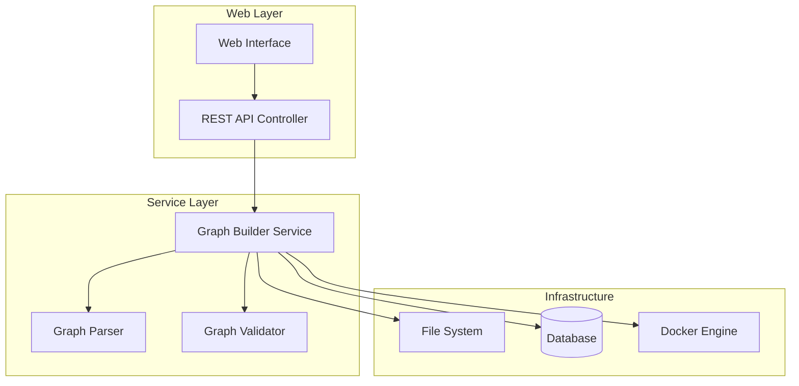

# Design Document

## Overview

This design extends the existing services/graph_builder-java service to support file upload capabilities for agent graph bundles. The solution adds REST API endpoints for uploading compressed files, a web interface for user interaction, asynchronous processing of uploaded bundles, and Docker image building for task and plan components.

The design leverages existing functionality in the graph_builder-java service for DOT file parsing and graph validation, while adding new components for file handling, web interface, and Docker integration.

## Architecture

### High-Level Components



### Component Interactions

1. **Web Interface** provides file upload form and status monitoring
2. **REST API Controller** handles file uploads and status queries
3. **Graph Builder Service** orchestrates the entire processing pipeline, parses DOT files, validates graphs, persists data, and builds Docker images

## Components and Interfaces

### 1. REST API Controller

**Location**: `com.pcallahan.agentic.graphbuilder.controller.GraphBundleController`

**Endpoints**:
- `POST /api/graph-bundle/upload` - Upload compressed bundle
- `GET /api/graph-bundle/status/{processId}` - Get processing status
- `GET /api/graph-bundle/list` - List uploaded bundles

**Request/Response Models**:
```java
public class BundleUploadRequest {
    private String tenantId;
    private MultipartFile file;
}

public class BundleUploadResponse {
    private String processId;
    private String status;
    private String message;
}

public class ProcessingStatus {
    private String processId;
    private String status; // UPLOADED, EXTRACTING, PARSING, PERSISTING, BUILDING_IMAGES, COMPLETED, FAILED
    private List<ProcessingStep> steps;
    private String errorMessage;
}
```

### 2. Web Interface Controller

**Location**: `com.pcallahan.agentic.graphbuilder.controller.GraphBundleWebController`

**Endpoints**:
- `GET /graph-bundle` - Serve upload page
- `GET /graph-bundle/status` - Serve status monitoring page

### 3. Service Layer Architecture

The service layer is refactored into focused, single-responsibility services within the same Spring Boot application:

#### 3.1 Graph Builder Service (Orchestrator)

**Location**: `com.pcallahan.agentic.graphbuilder.GraphBuilderService`

**Responsibilities**: Core graph parsing and orchestration
```java
public class GraphBuilderService {
    // Existing methods...
    public AgentGraph buildGraph(Path specificationDirectory);
    
    // Orchestration methods
    public String processBundle(String tenantId, MultipartFile file);
    public ProcessingStatus getProcessingStatus(String processId);
}
```

#### 3.2 Bundle Processing Service

**Location**: `com.pcallahan.agentic.graphbuilder.service.BundleProcessingService`

**Responsibilities**: File upload, extraction, and validation
```java
@Service
public class BundleProcessingService {
    public void validateFile(MultipartFile file);
    public Path extractBundle(MultipartFile file, String processId);
    public void validateExtractedStructure(Path extractDir);
    public void cleanupTempDirectory(Path tempDir);
}
```

#### 3.3 Docker Image Service

**Location**: `com.pcallahan.agentic.graphbuilder.service.DockerImageService`

**Responsibilities**: Docker image building and management
```java
@Service
public class DockerImageService {
    public String buildTaskImage(String tenantId, Task task, Path taskDirectory, String processId);
    public String buildPlanImage(String tenantId, Plan plan, Path planDirectory, String processId);
    public List<String> getBuiltImages(String processId);
    public void cleanupDockerImages(String processId);
}
```

#### 3.4 Graph Persistence Service

**Location**: `com.pcallahan.agentic.graphbuilder.service.GraphPersistenceService`

**Responsibilities**: Database operations for graphs
```java
@Service
public class GraphPersistenceService {
    public String persistGraph(AgentGraph graph, String tenantId, String processId);
    public AgentGraph getPersistedGraph(String graphId);
    public List<GraphInfo> listPersistedGraphs(String tenantId);
}
```

#### 3.5 Processing Status Service

**Location**: `com.pcallahan.agentic.graphbuilder.service.ProcessingStatusService`

**Responsibilities**: Processing status tracking and management
```java
@Service
public class ProcessingStatusService {
    public void createProcessingStep(String processId, String stepName, StepStatus status);
    public void updateBundleStatus(String processId, BundleStatus status, String errorMessage);
    public ProcessingStatus getProcessingStatus(String processId);
}
```

**Processing Pipeline** (orchestrated by GraphBuilderService):
1. BundleProcessingService validates and extracts file
2. GraphBuilderService parses agent_graph.dot using existing buildGraph method
3. GraphPersistenceService persists graph data to database
4. DockerImageService builds Docker images for tasks and plans
5. BundleProcessingService cleans up temporary files
6. ProcessingStatusService updates processing status throughout

### 4. Shared Web Resources

**Location**: Move from `services/admin-java/src/main/resources/static` to `services/common-java/src/main/resources/static`

**Files to Move**:
- `css/admin.css` → `css/common-admin.css`
- `js/admin.js` → `js/common-admin.js`

**New Files**:
- `css/graph-bundle.css` - Specific styles for graph bundle interface
- `js/graph-bundle.js` - JavaScript for upload and status monitoring

## Data Models

### Database Entities

```java
@Entity
public class GraphBundleEntity {
    @Id
    private String id;
    private String tenantId;
    private String graphName;
    private String fileName;
    private String status;
    private LocalDateTime uploadTime;
    private LocalDateTime completionTime;
    private String errorMessage;
    private String processId;
}

@Entity
public class ProcessingStepEntity {
    @Id
    private String id;
    private String processId;
    private String stepName;
    private String status;
    private LocalDateTime startTime;
    private LocalDateTime endTime;
    private String errorMessage;
}

@Entity
public class DockerImageEntity {
    @Id
    private String id;
    private String processId;
    private String imageName;
    private String imageTag;
    private String executorType; // TASK or PLAN
    private String executorName;
    private LocalDateTime buildTime;
}
```

### File Structure Validation

Expected bundle structure:
```
bundle.tar.gz/
├── agent_graph.dot
├── plans/
│   ├── plan1/
│   │   ├── plan.py
│   │   └── requirements.txt (optional)
│   └── plan2/
│       ├── plan.py
│       └── requirements.txt (optional)
└── tasks/
    ├── task1/
    │   ├── task.py
    │   └── requirements.txt (optional)
    └── task2/
        ├── task.py
        └── requirements.txt (optional)
```

## Error Handling

### Error Categories

1. **Upload Errors**:
   - Invalid file format
   - File size exceeded
   - Missing TENANT_ID

2. **Extraction Errors**:
   - Corrupted archive
   - Invalid directory structure
   - Missing agent_graph.dot

3. **Parsing Errors**:
   - Invalid DOT syntax
   - Graph validation failures
   - Missing task/plan files

4. **Persistence Errors**:
   - Database connection issues
   - Constraint violations
   - Transaction failures

5. **Docker Build Errors**:
   - Docker daemon unavailable
   - Build failures
   - Image tagging issues

### Error Recovery

- **Cleanup Strategy**: Always clean up temporary directories and partial database entries
- **Rollback Strategy**: Use database transactions for atomic operations
- **Retry Strategy**: Retry Docker builds up to 3 times with exponential backoff
- **Notification Strategy**: Log all errors and update processing status

## Testing Strategy

### Unit Tests

1. **Controller Tests**:
   - File upload validation
   - Request/response mapping
   - Error handling

2. **GraphBuilderService Tests**:
   - Bundle processing pipeline
   - Docker build operations
   - Graph persistence
   - Integration with existing parsing functionality

3. **Integration Tests**:
   - End-to-end upload flow
   - Database operations
   - Docker integration

### Test Data

- Sample valid bundles with various graph structures
- Invalid bundles for error testing
- Mock Docker responses for build testing

### Test Environment

- Use Testcontainers for Docker integration tests
- H2 in-memory database for unit tests
- Mock file system for upload tests

## Security Considerations

### File Upload Security

- Validate file extensions and MIME types
- Scan uploaded files for malicious content
- Limit file sizes and upload rates
- Use temporary directories with restricted permissions

### Docker Security

- Run Docker builds in isolated environments
- Validate Dockerfile content before building
- Use non-root users in generated images
- Implement resource limits for builds

### Access Control

- Validate TENANT_ID against authorized tenants
- Implement rate limiting for uploads
- Log all upload and processing activities
- Secure temporary file storage

## Performance Considerations

### Asynchronous Processing

- Use Spring's @Async for long-running operations
- Implement proper thread pool configuration
- Provide real-time status updates via polling

### Resource Management

- Limit concurrent uploads per tenant
- Implement cleanup jobs for old temporary files
- Monitor disk space usage
- Set timeouts for Docker builds

### Caching Strategy

- Cache parsed graphs for quick retrieval
- Cache Docker build contexts when possible
- Implement proper cache invalidation

## Deployment Considerations

### Dependencies

- Docker Engine must be available on deployment host
- Sufficient disk space for temporary files and images
- Database schema migrations for new entities

### Configuration

```yaml
graph-bundle:
  upload:
    max-file-size: 100MB
    allowed-extensions: [.tar, .tar.gz, .zip]
    temp-directory: /tmp/graph-bundles
  docker:
    base-image: services/executors-py:latest
    build-timeout: 300s
    max-concurrent-builds: 5
  processing:
    async-pool-size: 10
    status-retention-days: 30
```

### Monitoring

- Metrics for upload success/failure rates
- Docker build duration and success rates
- Disk space usage monitoring
- Processing queue depth monitoring