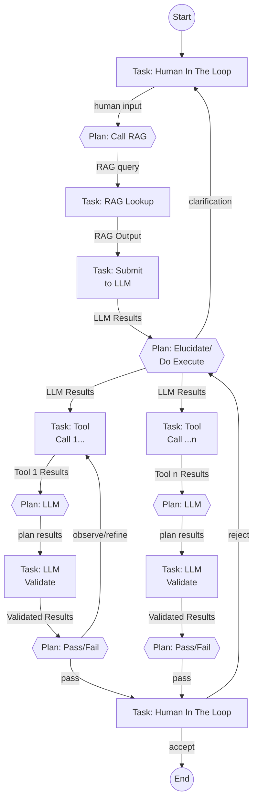

# Agentic Framework – High‑Level Overview

## Purpose & Vision

The framework allows developers to compose and execute **directed cyclic graphs of work items** (“AgentGraphs”) for agentic workflows. Each node is a Task that emits an immutable state object; edges transport that state to the next node, enabling transparent **plan → act → observe → act** cycles that repeat until a goal is reached or a guardrail intervenes, all while retaining full provenance.

**Why?**

* **Scalable Open Source Agent Runner** - Scales from running on a single laptop to a multitenant cloud deployment.
* **Clean separation of concerns** – "Tasks" handles *doing*, "Plans" handles *deciding*, letting you mix deterministic rules with LLM‑powered reasoning without entangling the two.
* **Simple Graph Abstraction** - Logically, Task nodes output to Plan nodes, and Plan nodes output to Task nodes in alternating tick-tock execution.
* **Runs everywhere** – the same graph definition executes on a laptop (in‑memory queue + SQLite) or at SaaS scale (Kafka + Postgres + S3) by swapping pluggable adapters.
* **Centralised guardrails** – cost, safety, and iteration caps enforced in the control plane so compliance and budgeting never rely on agent authors to ‘do the right thing’.
* **Auditable and Reproducible**– every Task Execution is an append‑only event that gets recorded.  Restart an agent from any point in  a previous execution.
* **Batteries‑included DX** – typed SDK, local dev server, YAML guardrail policies, and scaffold generators so teams can ship a proof‑of‑concept in minutes yet scale to production later.
* **Language‑agnostic core** – interfaces are JSON & gRPC; today’s Python SDK can coexist with a future JVM or Rust orchestrator without breaking existing agents.

### Example AgentGraph - Coding Agent



This Coding Agent example Agent Graph illustrates **plan → act → observe** loops:

* A human describes an app, leading to iterative LLM summarisation and clarification cycles.
* The planner can spawn parallel code‑generation branches (`CodeLLM1 … CodeLLM N`), each with its own validation and human acceptance loop.
* Conditional edges (dashed in text) show how planners route either back for refinement or forward toward acceptance, embodying both depth‑first and breadth‑first flows within a single AgentGraph.

---

## Core Domain Model  Core Domain Model

| Entity            | Description                                                                                                                         |
|-------------------|-------------------------------------------------------------------------------------------------------------------------------------|
| **AgentGraph**    | Immutable graph template (nodes + edges) with semantic versioning.                                                                  |
| **AgentLifetime** | One runtime instance of an AgentGraph executing to completion.                                                                      |
| **Task**          | Node type that performs work – API call, DB query, computation.                                                                     |
| **Plan**          | Node type that selects the **Task** based on rules or prior state.                                                                  |
| **Edge**          | Logical link between Tasks and Plans, mainly for configuration (`NORMAL`, `PARALLEL`, `JOIN`, `FINAL`).                             |
| **TaskResult**    | Structured output from any task type.  Used as input to the downstream **Plan**                                                     |
| **TaskExecution** | Record of a single run of a **Task**; Contains a **TaskResult** to be used as input to the next **Plan**.                           |
| **PlanResult**    | Structured output from any plan type.  Used as input to the downstream **Task**                                                     |
| **PlanExecution** | Record of a single run of a **Plan**; Contains the upstream **TaskResult** passed through to be used as input to the next **Task**. |         

---

##  TaskExecution - Execution Record

A record emitted on every TaskExecution.  Three sections:

1. **Headers** – identity, timing, status, iteration.
2. **Policy Telemetry** – `tokens_used`, `cost_usd`, `latency_ms`, etc.
3. **TaskResult** – `{ oneof:{inline: any | uri: string }, uri, size_bytes}` (big blobs referenced by URI to object storage, small blobs inlined.


---
##  Logical Flow (Happy Path)

1. **Task** executes and produces some output as a **TaskResult**.    
2. **TaskResult** is used as input to the downstream **Plan**.
3. **Plan** evaluates and produces a **PlanResult**.
4. Downstream **Task** executes using the **PlanResult** as input and produces a **TaskResult**.

##  Runtime Flow (Happy Path)

1. **Task** executes and produces some output.  
   * If the result is large (>1mb), the large result is written to the Blob Store and a **TaskResult** with a URI is created and wrapped in a **TaskExecution**.
   * If the result is small, the **TaskResult** is created with output inlined and wrapped in a **TaskExecution**.
   * The **TaskExecution** is published to the **Data Plane** topic.
2. **Data Plane** persists the **TaskExecution** in the State DB (append‑only) and republishes a *lightweight reference message* to the **Control Plane** topic.
3. **Control Plane** reads the reference, loads TaskExecution headers (and blob metadata), and evaluates YAML guardrails.
   * **Pass** → forwards the envelope (or just its reference) to the target **Plan** executor queue.
   * **Fail** → issues `REJECT_EXECUTION`, `PAUSE_LIFETIME`, or `ABORT_LIFETIME` events.
4. **Plan** is passed the previous **TaskExecution**s and **TaskResult**s from the **Control Plane**, produces a **PlanResult** listing `next_task_names[]`, and emits its own **PlanExecution**.
5. **Data Plane** persists the **PlanExecution** in the State DB (append‑only) and republishes a *lightweight reference message* to the **Control Plane** topic.
6. Step 1 repeats for the downstream **Task**, but with the **PlanResult** passed as input from the Control Plane.
7. Steps 2-6 repeat following the path of the graphuntil an edge of type `FINAL` is taken, completing the AgentLifetime.

---

## Layered Architecture

```
┌───────────────┐   User code: Tasks & Graphs (Python SDK)
│  SDK Layer    │
├───────────────┤   Deterministic router, guardrail engine, retry logic
│ Orchestrator  │
├───────────────┤   Pluggable adapters
│  Adapters     │  • Event Bus  (In‑mem | Kafka)
│               │  • State DB   (SQLite | Postgres)
│               │  • Blob Store (FS | S3)
│               │  • KV Store   (dict | Redis)
└───────────────┘
```

---

##  Deployment Profiles

| Profile   | Event Bus       | State DB             | Blob Store | KV / Cache   |
| --------- | --------------- | -------------------- | ---------- | ------------ |
| **Local** | `asyncio.Queue` | SQLite WAL           | Local FS   | In‑proc dict |
| **Cloud** | Kafka / Pulsar  | Postgres / Cockroach | S3 / GCS   | Redis        |
| **Test**  | `asyncio.Queue` | In-memory            | Local FS   | In-memory    |

Both profiles share identical envelope schema and guardrail logic.

---

##  Guardrail Policies (Control Plane ONLY)

* Declarative YAML (`sum(tokens_used) > 10 000 → abort_lifetime`).
* Enforced per‑execution or cumulative per‑lifetime/tenant.
* Actions on breach: `REJECT_EXECUTION`, `PAUSE_LIFETIME`, `ABORT_LIFETIME`.

---

##  Extensibility Points

* **Task SDK** – subclass Task for custom tasks.
* **Plan SDK** – subclass Plan for custom plans.
* **Adapter SPI** – implement `EventBus`, `StateStore`, `BlobStore`, `KVStore` for new environments.
* **Guardrail Engine** – pluggable policy language (YAML v1, Rego later).
* **Language Ports** – JVM orchestrator can replace Python core; interfaces stay JSON/gRPC.

---

##  Non‑Functional Goals

* **Deterministic replay** – given the same envelopes, a graph run reproduces edge choices.
* **Horizontal scalability** – SaaS tier targets 10 k concurrent AgentLifetimes.
* **Latency budget** – <250 ms p99 planner loop in cloud mode.
* **Cost transparency** – real‑time spend & token tracking per tenant.
* **Security** – per‑tenant topic isolation, SSE‑KMS encryption at rest.

---

##  Roadmap to MVP

1. Finalise JSON Schema for ExecutionEnvelope + Plan (v1).
2. Ship Python SDK (Task, Plan, telemetry helper).
3. Implement local profile adapters; run “Hello World” graph.
4. Build guardrail engine with YAML policies + unit tests.
5. Cloud profile adapters (Kafka, Postgres, S3, Redis) & Helm chart.
