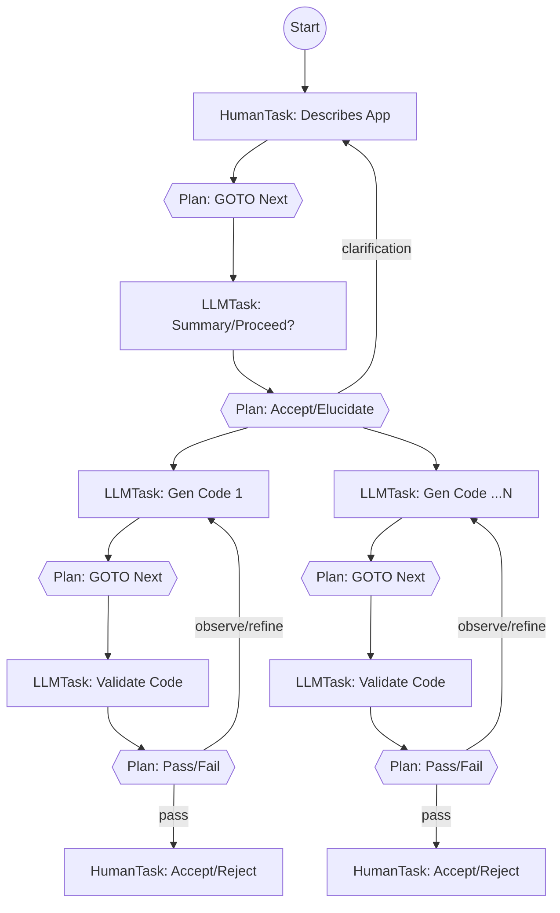

# Agentic Framework – High‑Level Overview

## 1  Purpose & Vision

The framework empowers developers to compose and execute **directed—possibly cyclic—graphs of work items** (“AgentGraphs”). Each node is a Task that emits an immutable state object; edges transport that state to the next node, enabling transparent **plan  → act  → observe  → act** cycles that repeat until a goal is reached or a guardrail intervenes, all while retaining full provenance.

**Why we’re building it**

* **Clean separation of concerns** – "Action" Tasks handles *doing*, "Planner" tasks handles *deciding*, letting you mix deterministic rules with LLM‑powered reasoning without entangling the two.
* **Runs everywhere** – the same graph definition executes on a laptop (in‑memory queue + SQLite) or at SaaS scale (Kafka + Postgres + S3) by swapping pluggable adapters.
* **Centralised guardrails** – cost, safety, and iteration caps enforced in the control plane so compliance and budgeting never rely on agent authors to ‘do the right thing’.
* **Auditable and Reproducible**– every Task Execution is an append‑only event that gets recorded.   Restart an agent from any point in  a previous execution.
* **Batteries‑included DX** – typed SDK, local dev server, YAML guardrail policies, and scaffold generators so teams can ship a proof‑of‑concept in minutes yet scale to production later.
* **Language‑agnostic core** – interfaces are JSON & gRPC; today’s Python SDK can coexist with a future JVM or Rust orchestrator without breaking existing agents.

### Example AgentGraph



This Coding Agent example Agent Graph illustrates  **plan → act → observe** loops:

* A human describes an app, leading to iterative LLM summarisation and clarification cycles.
* The planner can spawn parallel code‑generation branches (`CodeLLM1 … CodeLLM N`), each with its own validation and human acceptance loop.
* Conditional edges (dashed in text) show how planners route either back for refinement or forward toward acceptance, embodying both depth‑first and breadth‑first flows within a single AgentGraph.

---

## 2    Core Domain Model    Core Domain Model

| Entity            | Description                                                                     |
| ----------------- | ------------------------------------------------------------------------------- |
| **AgentGraph**    | Immutable graph template (nodes + edges) with semantic versioning.              |
| **AgentLifetime** | One runtime instance of an AgentGraph executing to completion.                  |
| **ActionTask**    | Node subtype that performs work – API call, DB query, computation.              |
| **PlannerTask**   | Node subtype that selects the next edge(s) based on prior state.                |
| **Edge**          | Directed link (`NORMAL`, `PARALLEL`, `JOIN`, `FINAL`).                          |
| **TaskExecution** | Single run of an ActionTask or PlannerTask; produces an **Execution Envelope**. |

---

## 3    Execution Envelope (v1)

A JSON record emitted on every TaskExecution.  Three sections:

1. **Headers** – identity, timing, status, iteration.
2. **Policy  Telemetry** – `tokens_used`, `cost_usd`, `latency_ms`, etc.
3. **Result** – `{content_type, uri, size_bytes, checksum, schema_uri}` (big blobs live in object storage).

Optional **policy\_feedback** is appended by the control plane (e.g., remaining budget).

---

## 4    Runtime Flow (Happy Path)

1. **ActionTask** writes any large result to the Blob  Store **and emits a TaskExecution envelope** to the **Data  Plane** (event‑bus topic).
2. **Data Plane** persists the envelope in the State  DB (append‑only) and republishes a *lightweight reference message* to the **Control  Plane** topic.
3. **Control Plane** reads the reference, loads envelope headers (and blob metadata), and evaluates YAML guardrails.

    * **Pass**  → forwards the envelope (or just its reference) to the target **PlannerTask** queue.
    * **Fail**  → issues `REJECT_EXECUTION`, `PAUSE_LIFETIME`, or `ABORT_LIFETIME` events.
4. **PlannerTask** (rule‑based or LLM) fetches the blob if needed, produces a structured **Plan** listing `next_task_ids[]`, and emits its own envelope back to the **Data  Plane**.
5. Steps  1‑4 repeat as the Control  Plane routes to downstream ActionTask(s) until an edge of type `FINAL` is taken, completing the AgentLifetime.

---

## 5    Layered Architecture

```
┌───────────────┐   User code: Tasks & Graphs (Python SDK)
│  SDK Layer    │
├───────────────┤   Deterministic router, guardrail engine, retry logic
│ Orchestrator  │
├───────────────┤   Pluggable adapters
│  Adapters     │  • Event Bus  (In‑mem | Kafka)
│               │  • State DB   (SQLite | Postgres)
│               │  • Blob Store (FS | S3)
│               │  • KV Store   (dict | Redis)
└───────────────┘
```

---

## 6    Deployment Profiles

| Profile   | Event Bus       | State DB             | Blob Store | KV / Cache   |
| --------- | --------------- | -------------------- | ---------- | ------------ |
| **Local** | `asyncio.Queue` | SQLite WAL           | Local FS   | In‑proc dict |
| **Cloud** | Kafka / Pulsar  | Postgres / Cockroach | S3 / GCS   | Redis        |

Both profiles share identical envelope schema and guardrail logic.

---

## 7    Guardrail Policies (Control Plane ONLY)

* Declarative YAML (`sum(tokens_used) > 10 000 → abort_lifetime`).
* Enforced per‑execution or cumulative per‑lifetime/tenant.
* Actions on breach: `REJECT_EXECUTION`, `PAUSE_LIFETIME`, `ABORT_LIFETIME`.

---

## 8    Extensibility Points

* **Task SDK** – subclass ActionTask / PlannerTask; emit telemetry via helper.
* **Adapter SPI** – implement `EventBus`, `StateStore`, `BlobStore`, `KVStore` for new environments.
* **Guardrail Engine** – pluggable policy language (YAML v1, Rego later).
* **Language Ports** – JVM orchestrator can replace Python core; interfaces stay JSON/gRPC.

---

## 9    Non‑Functional Goals

* **Deterministic replay** – given the same envelopes, a graph run reproduces edge choices.
* **Horizontal scalability** – SaaS tier targets 10 k concurrent AgentLifetimes.
* **Latency budget** – <250 ms p99 planner loop in cloud mode.
* **Cost transparency** – real‑time spend & token tracking per tenant.
* **Security** – per‑tenant topic isolation, SSE‑KMS encryption at rest.

---

## 10    Roadmap to MVP

1. Finalise JSON Schema for ExecutionEnvelope + Plan (v1).
2. Ship Python SDK (ActionTask, PlannerTask, telemetry helper).
3. Implement local profile adapters; run “Hello  World” graph.
4. Build guardrail engine with YAML policies + unit tests.
5. Cloud profile adapters (Kafka, Postgres, S3, Redis) & Helm chart.
