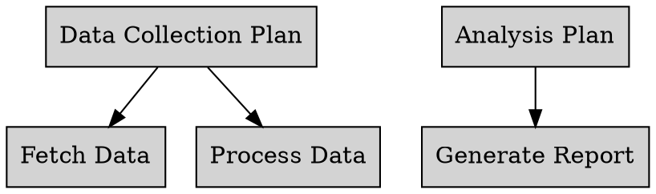
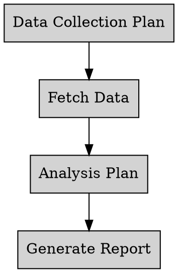

# Agent Graph Specification System

## Overview

The Agent Graph Specification System allows defining dynamic agent graphs using GraphViz DOT files. This system replaces the current hardcoded executor services with dynamically defined agent graphs that can be specified declaratively.

### Key Benefits

- **Declarative Configuration**: Define agent graphs using standard GraphViz DOT syntax
- **Dynamic Execution**: Replace hardcoded services with flexible graph-based execution
- **Validation**: Comprehensive validation ensures graph integrity and correctness
- **Extensible**: Pluggable parser architecture supports multiple specification formats
- **Type Safety**: Strong typing with Java records ensures data integrity

## Directory Structure

A complete agent graph specification consists of the following directory structure:

```
specification_directory/
├── agent_graph.dot          # Graph specification file (GraphViz DOT format)
├── plans/                   # Python subprojects for plans
│   ├── plan_name1/
│   │   ├── plan.py         # Plan implementation
│   │   └── requirements.txt # Plan dependencies
│   └── plan_name2/
│       ├── plan.py
│       └── requirements.txt
└── tasks/                   # Python subprojects for tasks
    ├── task_name1/
    │   ├── task.py         # Task implementation
    │   └── requirements.txt # Task dependencies
    └── task_name2/
        ├── task.py
        └── requirements.txt
```

### Required Files

#### Graph Specification File
- **Format**: GraphViz DOT (`.dot` extension)
- **Location**: Root of specification directory
- **Purpose**: Defines nodes (plans/tasks) and edges (data flow)
- **Naming**: Must be named `agent_graph.dot`

#### Plan Implementation
- **File**: `plan.py` in each plan subdirectory
- **Function**: `plan(upstream_results: List[TaskResult]) -> PlanResult`
- **Purpose**: Process results from upstream tasks and produce plan results
- **Directory**: Must be in `plans/` directory with subdirectory matching node name

#### Task Implementation
- **File**: `task.py` in each task subdirectory
- **Function**: `execute(upstream_plan: PlanResult) -> TaskResult`
- **Purpose**: Process results from upstream plans and produce task results
- **Directory**: Must be in `tasks/` directory with subdirectory matching node name

#### Dependencies
- **File**: `requirements.txt` in each subdirectory
- **Format**: Standard Python requirements format
- **Purpose**: Define Python dependencies for each plan/task
- **Required**: Every plan and task subdirectory must have this file

## Graph Specification Format

### GraphViz DOT Syntax

The graph specification uses standard GraphViz DOT syntax with custom attributes to distinguish between plans and tasks:



### Node Identification

Nodes are identified as plans or tasks using one of these methods:

1. **Node Attributes**: Use `type="plan"` or `type="task"` attributes
2. **Naming Convention**: Nodes starting with `plan_` or `task_` prefix
3. **Content Analysis**: Parser analyzes node content for plan/task keywords

### Edge Semantics

- **Plan → Task**: Plan results feed into task execution
- **Task → Plan**: Task results feed into plan execution
- **Constraints**: Tasks can only have one upstream plan, plans can have multiple upstream tasks

## Plan and Task Requirements

### Plan Implementation

Each plan must implement a `plan.py` file with the following signature:

```python
from typing import List

def plan(upstream_results: List[TaskResult]) -> PlanResult:
    """
    Process results from upstream tasks and produce a plan result.
    
    Args:
        upstream_results: List of results from upstream tasks
        
    Returns:
        PlanResult: The plan result that will be consumed by downstream tasks
    """
    # Implementation here
    return PlanResult(data=processed_data)
```

### Task Implementation

Each task must implement a `task.py` file with the following signature:

```python
def execute(upstream_plan: PlanResult) -> TaskResult:
    """
    Process results from upstream plan and produce a task result.
    
    Args:
        upstream_plan: Result from the upstream plan
        
    Returns:
        TaskResult: The task result that will be consumed by downstream plans
    """
    # Implementation here
    return TaskResult(data=processed_data)
```

### Task and Plan Dependencies

Each plan and task subdirectory must contain a `requirements.txt` file:

```
# Example requirements.txt for a plan
requests>=2.25.0
pandas>=1.3.0
numpy>=1.20.0

# Example requirements.txt for a task
pandas>=1.3.0
scikit-learn>=1.0.0
```

## Validation Rules

The system enforces the following integrity constraints:

### Graph Structure
- **Unique Names**: All plan and task names must be unique across the entire graph
- **Valid Identifiers**: Node names must be valid Python identifiers (letters, digits, underscores)
- **Connectivity**: All nodes must be connected (no orphaned nodes)
- **Cycles Allowed**: The graph can contain cycles (circular dependencies are permitted)

### Edge Constraints
- **Dangling References**: All edges must reference existing nodes
- **Task Single Upstream**: Each task can only have one upstream plan
- **Plan Multiple Upstream**: Plans can have multiple upstream tasks
- **Valid Flow**: Edges must connect plans to tasks or tasks to plans

### Plan and Task Constraints
- **Plan Feeds Into Tasks**: Every plan must feed into one or more tasks
- **Task Has Upstream Plan**: Every task must have an upstream/parent plan

### Directory Structure
- **Required Directories**: `plans/` and `tasks/` directories must exist
- **Python Files**: Each plan must have `plan.py`, each task must have `task.py`
- **Requirements**: Each subdirectory must have `requirements.txt`
- **Directory Names**: Plan and task subdirectory names must exactly match the node names in the DOT file

### File Validation
- **Python Syntax**: All Python files must have valid syntax
- **Function Signatures**: Functions must match expected signatures
- **Dependencies**: Requirements files must be valid Python requirements format

## Parser Extension

The system uses a pluggable parser architecture that allows adding support for new specification formats.


### Supported Formats

Currently supported formats:
- **GraphViz DOT**: `.dot` files
- **Future**: JSON, YAML, mermaid formats


### GraphParsingException

Thrown when the specification file cannot be parsed:

- **Malformed DOT syntax**
- **Missing specification file**
- **Invalid file format**
- **I/O errors**

```java
GraphParsingException e = GraphParsingException.parsingError(
    "agent_graph.dot", 
    "Invalid DOT syntax at line 5"
);
```

### GraphValidationException

Thrown when the graph violates integrity constraints:

- **Duplicate node names**
- **Dangling edge references**
- **Task multiple upstream plans**
- **Orphaned nodes**
- **Invalid node names**
- **Missing directories/files**
- **Plans not feeding into tasks**
- **Tasks without upstream plans**

```java
GraphValidationException e = GraphValidationException.invalidGraph(
    GraphValidationException.ViolationType.DUPLICATE_NAME,
    "plan_data_collection",
    "Duplicate plan name: plan_data_collection"
);
```

### Common Error Scenarios

1. **Missing Python Files**:
   ```
   Validation error: Plan directory does not exist: /path/plans/plan1
   ```

2. **Dangling Edge**:
   ```
   Validation error: Plan plan1 references non-existent task: nonexistent_task
   ```

3. **Task Multiple Plans**:
   ```
   Validation error: Task task1 upstream plan mismatch: task says plan1, graph says plan2
   ```

4. **Invalid Node Name**:
   ```
   Validation error: Invalid plan name: invalid-plan-name (must be a valid identifier)
   ```

5. **Plan Not Feeding Into Tasks**:
   ```
   Validation error: Plan plan1 does not feed into any tasks
   ```

6. **Task Without Upstream Plan**:
   ```
   Validation error: Task task1 has no upstream plan
   ```

## Testing

The system includes comprehensive test infrastructure with example graphs located in `src/test/resources/valid_graphs/`. These examples demonstrate various graph patterns including:

- Simple linear graphs
- Graphs with cycles
- Multi-plan graphs
- Parallel task graphs

Each test graph includes complete DOT specifications and corresponding Python plan/task implementations.

## Best Practices

### Graph Design

1. **Clear Naming**: Use descriptive names for plans and tasks
   ```dot
   plan_data_collection [label="Data Collection Plan"];
   task_fetch_api_data [label="Fetch API Data"];
   ```

2. **Logical Flow**: Design graphs with clear data flow patterns
   ```dot
   plan_data_collection -> task_fetch_data;
   task_fetch_data -> plan_analysis;
   plan_analysis -> task_generate_report;
   ```

3. **Modular Structure**: Break complex graphs into logical components
   ```dot
   // Data collection phase
   plan_data_collection -> task_fetch_data;
   plan_data_collection -> task_validate_data;
   
   // Analysis phase
   task_fetch_data -> plan_analysis;
   task_validate_data -> plan_analysis;
   ```


## Examples

### Complete Working Example

**Directory Structure**:
```
data_processing_graph/
├── agent_graph.dot
├── plans/
│   ├── plan_data_collection/
│   │   ├── plan.py
│   │   └── requirements.txt
│   └── plan_analysis/
│       ├── plan.py
│       └── requirements.txt
└── tasks/
    ├── task_fetch_data/
    │   ├── task.py
    │   └── requirements.txt
    └── task_generate_report/
        ├── task.py
        └── requirements.txt
```

**agent_graph.dot**:


**plans/plan_data_collection/plan.py**:
```python
from typing import List

class TaskResult:
    def __init__(self, data):
        self.data = data

class PlanResult:
    def __init__(self, data):
        self.data = data

def plan(upstream_results: List[TaskResult]) -> PlanResult:
    """
    Collect and aggregate data from upstream tasks.
    """
    aggregated_data = []
    for result in upstream_results:
        aggregated_data.extend(result.data)
    
    return PlanResult(data=aggregated_data)
```

**plans/plan_data_collection/requirements.txt**:
```
requests>=2.25.0
pandas>=1.3.0
```

**tasks/task_fetch_data/task.py**:
```python
import requests

class PlanResult:
    def __init__(self, data):
        self.data = data

class TaskResult:
    def __init__(self, data):
        self.data = data

def execute(upstream_plan: PlanResult) -> TaskResult:
    """
    Fetch data from external API based on plan parameters.
    """
    # Extract parameters from plan
    params = upstream_plan.data
    
    # Fetch data
    response = requests.get("https://api.example.com/data", params=params)
    data = response.json()
    
    return TaskResult(data=data)
```

**tasks/task_fetch_data/requirements.txt**:
```
requests>=2.25.0
```

**Java Usage**:
```java
GraphBuilderService service = new GraphBuilderService();
Path specDir = Paths.get("data_processing_graph");
AgentGraph graph = service.buildGraph(specDir);

System.out.println("Graph built successfully!");
System.out.println("Plans: " + graph.planCount());
System.out.println("Tasks: " + graph.taskCount());
```

This example demonstrates a complete working agent graph specification with proper validation, error handling, and clear data flow patterns. 