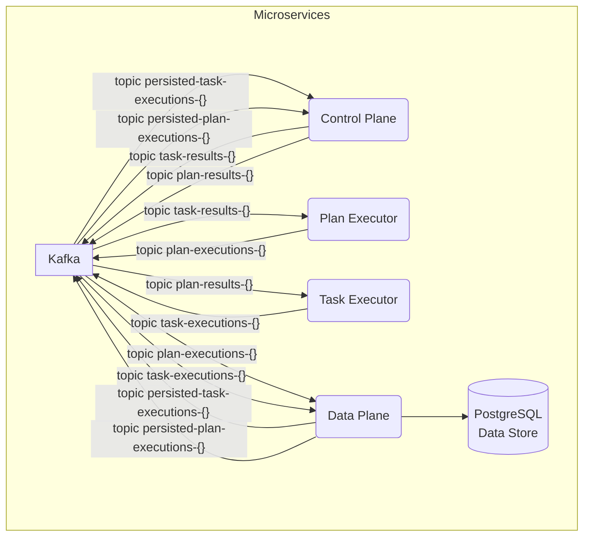
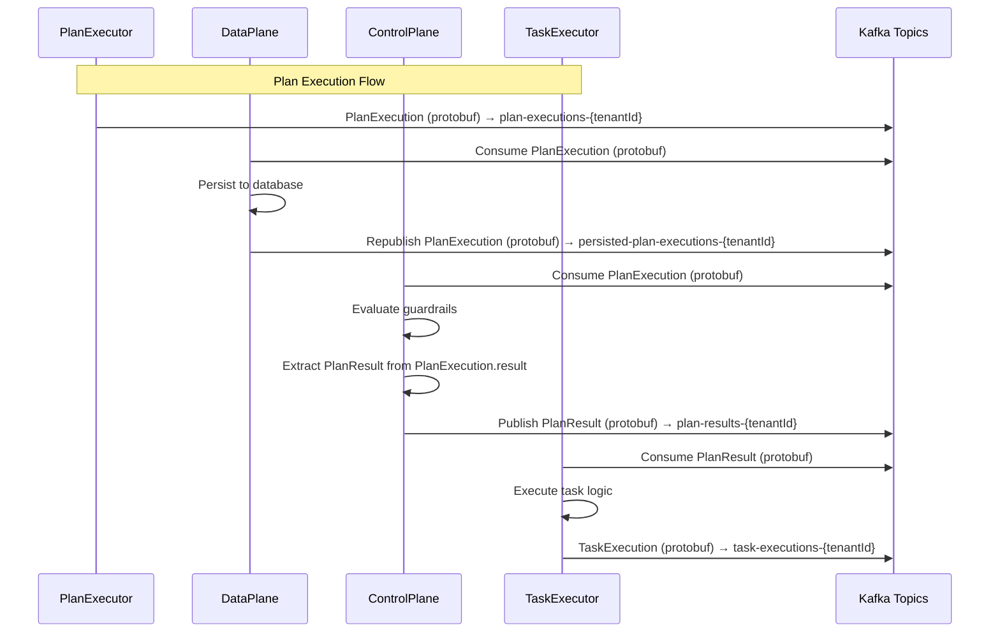

# Architecture and Data Flow Documentation

## Overview

This document describes the corrected protobuf-based data flow between microservices in the scalable agent framework. The system uses Protocol Buffers for all message serialization to ensure type safety and performance benefits.

## Services Architecture

The system consists of the following microservices:

1. **DataPlane** - Persists execution data and forwards protobuf messages to control topics
2. **ControlPlane** - Evaluates guardrails and routes messages between PlanExecutors and TaskExecutors
3. **TaskExecutor** - Executes individual tasks and publishes TaskExecution protobuf messages
4. **PlanExecutor** - Executes planning logic and publishes PlanExecution protobuf messages

This diagram shows the high-level architecture of the microservices in the Scalable Agent Framework.

## Message Flow

### 1. Task Execution Flow

### 2. Plan Execution Flow

## Topic Architecture

### Data Plane Topics
- `task-executions-{tenantId}` - TaskExecutor publishes TaskExecution protobuf messages
- `plan-executions-{tenantId}` - PlanExecutor publishes PlanExecution protobuf messages

### Control Topics
- `persisted-task-executions-{tenantId}` - DataPlane forwards TaskExecution protobuf messages to ControlPlane
- `persisted-plan-executions-{tenantId}` - DataPlane forwards PlanExecution protobuf messages to ControlPlane

### Result Topics
- `task-results-{tenantId}` - ControlPlane publishes TaskResult protobuf messages for PlanExecutor
- `plan-results-{tenantId}` - ControlPlane publishes PlanResult protobuf messages for TaskExecutor

## Protobuf Message Structures

### [TaskExecution](../protos/task.proto#L30-L42)
### [TaskResult](../protos/task.proto#L9-L30)
### [PlanExecution](../protos/plan.proto#L27-L42)
### [PlanResult](../protos/plan.proto#L9-L27)

## Service Responsibilities

### DataPlane
- Consumes TaskExecution and PlanExecution protobuf messages from executors
- Persists execution data to database using JPA entities
- Forwards protobuf messages to control topics without modification
- Uses ProtobufUtils for serialization/deserialization
- **Persistence**: Stores task results, plan states, and metadata
- **State Management**: Maintains execution state and history
- **Metadata Storage**: Stores task/plan definitions and configurations
- **Data Retrieval**: Provides APIs for querying execution data

### ControlPlane
- Consumes TaskExecution and PlanExecution protobuf messages from data plane
- Evaluates guardrails using protobuf message data
- Extracts TaskResult from TaskExecution.result and PlanResult from PlanExecution.result
- Publishes TaskResult and PlanResult protobuf messages to result topics
- Uses ProtobufUtils for serialization/deserialization
- **Guardrails**: Enforces policies and constraints on agent behavior
- **Routing**: Determines which tasks/plans should be executed
- **Policy Management**: Loads and applies execution policies
- **Request Validation**: Validates incoming requests against policies

### TaskExecutor
- Consumes PlanResult protobuf messages from control plane
- Executes tasks based on PlanResult.nextTaskIds
- Publishes TaskExecution protobuf messages to data plane
- Uses ProtobufUtils for serialization/deserialization
- **Task Execution**: Executes individual tasks based on registered implementations
- **Registry Management**: Maintains registry of available tasks
- **Result Processing**: Processes and forwards execution results
- **Task Handlers**: Executes different types of tasks (text generation, code execution, data processing)

### PlanExecutor
- Consumes TaskResult protobuf messages from control plane
- Executes planning logic based on TaskResult data
- Publishes PlanExecution protobuf messages to data plane
- Uses ProtobufUtils for serialization/deserialization
- **Plan Execution**: Orchestrates plan execution and task sequencing
- **Registry Management**: Maintains registry of available plans
- **Result Processing**: Processes and forwards execution results
- **Plan Handlers**: Executes different types of plans (sequential, conditional, parallel)

## Output Message Flow from Executors to Data and Control Planes

1. **Task Execution Flow**: Task Executor → Data Plane → Control Plane
2. **Plan Execution Flow**: Plan Executor → Data Plane → Control Plane

## Input Message Flow from Control Plane to Task and Plan Executors

1. **Control Flow**: Data Plane → Control Plane → Executors
2. **Result Flow**: Executors → Data Plane → Control Plane

## Kafka Topics

- **task-executions-{tenantId}**: `TaskExecution` messages (including `TaskResult`) from Task Executor for the Data Plane
- **plan-executions-{tenantId}**: `PlanExecution` messages (including `PlanResult`) from Plan Executor for the Data Plane
- **persisted-task-executions-{tenantId}**: Persisted `TaskExecution` messages from Data Plane to Control Plane
- **persisted-plan-executions-{tenantId}**: Persisted `PlanExecution` messages from Data Plane to Control Plane
- **task-results-{tenantId}**: `TaskResult` messages from Control Plane to the Plan Executor (**note the crossover**)
- **plan-results-{tenantId}**: `PlanResult` messages from Control Plane to the Task Executor (**note the crossover**)

## Key Implementation Details

### Protobuf Serialization
All services use `ProtobufUtils` for consistent serialization/deserialization:
- `ProtobufUtils.serializeTaskExecution()` / `deserializeTaskExecution()`
- `ProtobufUtils.serializePlanExecution()` / `deserializePlanExecution()`
- `ProtobufUtils.serializeTaskResult()` / `deserializeTaskResult()`
- `ProtobufUtils.serializePlanResult()` / `deserializePlanResult()`

### Kafka Configuration
- All producers use `KafkaTemplate<String, byte[]>` for protobuf messages
- All consumers use `ConsumerRecord<String, byte[]>` for protobuf messages
- Topic patterns use tenant-aware routing with `{tenantId}` placeholders

### Error Handling
- Failed deserialization results in message acknowledgment to prevent infinite loops
- Guardrail evaluation failures are logged but don't block message flow
- Database persistence failures are logged but don't block message forwarding

### Database Persistence
- TaskExecutionEntity and PlanExecutionEntity mirror protobuf structures
- JPA entities include all protobuf fields with appropriate type mappings
- JSON fields store complex protobuf data as serialized JSON strings

## Benefits of Protobuf Implementation

1. **Type Safety** - Compile-time validation of message structures
2. **Performance** - Efficient binary serialization/deserialization
3. **Schema Evolution** - Backward/forward compatibility for message changes
4. **Consistency** - Uniform message format across all services
5. **Validation** - Built-in message validation and error handling

## Monitoring and Observability

- All services log protobuf message processing with execution IDs
- Kafka topic metrics track message throughput and latency
- Database persistence metrics monitor storage performance
- Guardrail evaluation results are logged for audit trails