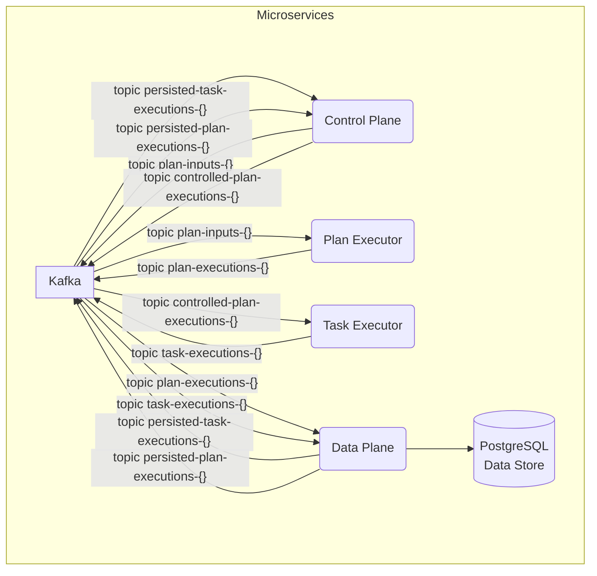
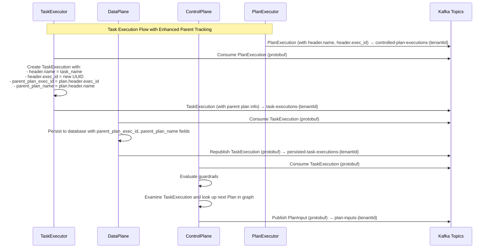
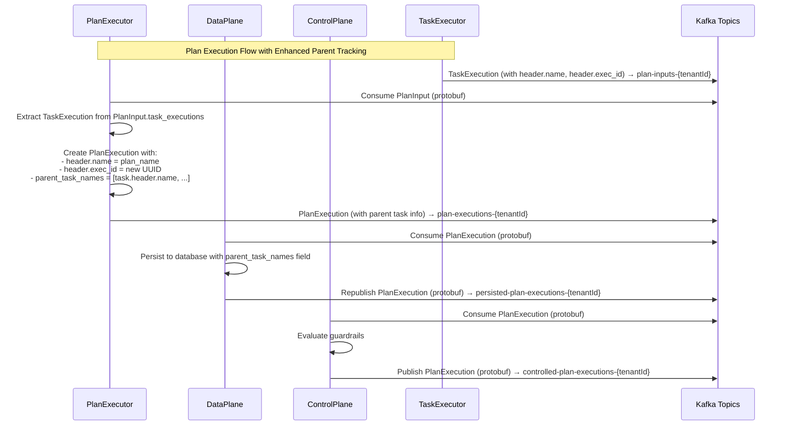

# Architecture and Data Flow Documentation

## Overview

This document describes the corrected protobuf-based data flow between microservices in the scalable agent framework. The system uses Protocol Buffers for all message serialization to ensure type safety and performance benefits.

## Enhanced Parent-Child Relationship Tracking

The system now includes enhanced parent-child relationship tracking between TaskExecutions and PlanExecutions:

- **TaskExecution** tracks its parent PlanExecution via `parent_plan_exec_id` and `parent_plan_name` fields
- **PlanExecution** tracks its parent TaskExecutions via `parent_task_names` field (repeated string)
- **ExecutionHeader** now has `name` field (unique identifier of the Plan/Task that created this execution) and `exec_id` field (renamed from `id`)

## Services Architecture

The system consists of the following microservices:

1. **DataPlane** - Persists execution data and forwards protobuf messages to control topics
2. **ControlPlane** - Evaluates guardrails and routes full execution messages between PlanExecutors and TaskExecutors
3. **TaskExecutor** - Executes individual tasks and publishes TaskExecution protobuf messages
4. **PlanExecutor** - Executes planning logic and publishes PlanExecution protobuf messages

This diagram shows the high-level architecture of the microservices in the Scalable Agent Framework.




## Message Flow

### 1. Task Execution Flow with Parent Tracking



### 2. Plan Execution Flow with Parent Tracking



## Protobuf Message Structure

### ExecutionHeader (common.proto)
```protobuf
message ExecutionHeader {
  string name = 1;           // Unique identifier of the Plan/Task that created this execution
  string exec_id = 2;        // Unique identifier for this execution (renamed from id)
  string parent_id = 3;      // ID of the parent execution (empty for root executions)
  string graph_id = 4;       // ID of the AgentGraph being executed
  string lifetime_id = 5;    // ID of the AgentLifetime instance
  string tenant_id = 6;      // Tenant identifier for multi-tenancy
  int32 attempt = 7;         // Execution attempt number (1-based)
  int32 iteration_idx = 8;   // Current iteration index within the graph
  string created_at = 9;     // ISO-8601 timestamp when execution was created
  ExecutionStatus status = 10; // Current execution status
  string edge_taken = 11;    // ID of the edge that led to this execution
}
```

### TaskExecution (task.proto)
```protobuf
message TaskExecution {
  agentic.common.ExecutionHeader header = 1;
  string parent_plan_exec_id = 2;    // Execution ID of the parent/upstream PlanExecution.exec_id
  TaskResult result = 3;
  string task_type = 4;
  string parent_plan_name = 5;       // Name from the parent/upstream PlanExecution.header.name
}
```

### PlanExecution (plan.proto)
```protobuf
message PlanExecution {
  agentic.common.ExecutionHeader header = 1;
  repeated string parent_task_names = 2;  // Names of one or more parent/upstream TaskExecution.header.name values
  PlanResult result = 3;
  string plan_type = 4;
  string input_task_id = 5;
}
```

### PlanInput (plan.proto)
```protobuf
message PlanInput {
  string input_id = 1;                    // Unique identifier for this input for auditing
  string plan_name = 2;                   // Name of the next plan in the graph path
  repeated TaskExecution task_executions = 3; // Task executions that provide input to this plan
}
```

## Key Changes

1. **ExecutionHeader.id → exec_id**: The execution identifier field has been renamed for clarity
2. **ExecutionHeader.name**: New field to identify the Plan/Task definition that created this execution
3. **TaskExecution.parent_plan_exec_id**: Tracks the execution ID of the parent PlanExecution
4. **TaskExecution.parent_plan_name**: Tracks the name of the parent PlanExecution
5. **PlanExecution.parent_task_names**: Tracks the names of parent TaskExecutions (repeated field)
6. **ControlPlane graph lookup**: ControlPlane now examines TaskExecution and looks up the next Plan in the graph before publishing to PlanExecutor

These changes enable comprehensive parent-child relationship tracking throughout the execution flow, allowing for better debugging, monitoring, and data lineage analysis.

## Topic Architecture

### Data Plane Topics
- `task-executions-{tenantId}` - TaskExecutor publishes TaskExecution protobuf messages
- `plan-executions-{tenantId}` - PlanExecutor publishes PlanExecution protobuf messages

### Control Topics
- `persisted-task-executions-{tenantId}` - DataPlane forwards TaskExecution protobuf messages to ControlPlane
- `persisted-plan-executions-{tenantId}` - DataPlane forwards PlanExecution protobuf messages to ControlPlane

### Control Topics
- `plan-inputs-{tenantId}` - ControlPlane publishes PlanInput protobuf messages (converted from TaskExecution) for PlanExecutor
- `controlled-plan-executions-{tenantId}` - ControlPlane publishes PlanExecution protobuf messages for TaskExecutor

## Protobuf Message Structures

### [TaskExecution](../protos/task.proto#L30-L42)
### [TaskResult](../protos/task.proto#L9-L30)
### [PlanExecution](../protos/plan.proto#L27-L42)
### [PlanResult](../protos/plan.proto#L9-L27)
### [PlanInput](../protos/plan.proto#L44-L52)


## Service Responsibilities

### DataPlane
- Consumes TaskExecution and PlanExecution protobuf messages from executors
- Persists execution data to database using JPA entities
- Forwards protobuf messages to control topics without modification
- Uses ProtobufUtils for serialization/deserialization
- **Persistence**: Stores task results, plan states, and metadata
- **State Management**: Maintains execution state and history
- **Metadata Storage**: Stores task/plan definitions and configurations
- **Data Retrieval**: Provides APIs for querying execution data

### ControlPlane
- Consumes TaskExecution and PlanExecution protobuf messages from data plane
- Evaluates guardrails using protobuf message data
- Examines TaskExecution and looks up the next Plan in the graph
- Publishes full PlanInput and PlanExecution protobuf messages to controlled topics
- Uses ProtobufUtils for serialization/deserialization
- **Guardrails**: Enforces policies and constraints on agent behavior
- **Routing**: Determines which tasks/plans should be executed
- **Policy Management**: Loads and applies execution policies
- **Request Validation**: Validates incoming requests against policies
- **Graph Lookup**: Examines TaskExecution to determine next plan in graph path

### TaskExecutor
- Consumes PlanExecution protobuf messages from control plane
- Extracts PlanResult from PlanExecution.result for task execution
- Executes tasks based on PlanResult.nextTaskIds
- Publishes TaskExecution protobuf messages to data plane
- Uses ProtobufUtils for serialization/deserialization
- **Task Execution**: Executes individual tasks based on registered implementations
- **Registry Management**: Maintains registry of available tasks
- **Result Processing**: Processes and forwards execution results
- **Task Handlers**: Executes different types of tasks (text generation, code execution, data processing)

### PlanExecutor
- Consumes PlanInput protobuf messages from control plane
- Extracts TaskExecution objects from PlanInput.task_executions for plan execution
- Executes planning logic based on TaskExecution data
- Publishes PlanExecution protobuf messages to data plane
- Uses ProtobufUtils for serialization/deserialization
- **Plan Execution**: Orchestrates plan execution and task sequencing
- **Registry Management**: Maintains registry of available plans
- **Result Processing**: Processes and forwards execution results
- **Plan Handlers**: Executes different types of plans (sequential, conditional, parallel)

## Output Message Flow from Executors to Data and Control Planes

1. **Task Execution Flow**: Task Executor → Data Plane → Control Plane
2. **Plan Execution Flow**: Plan Executor → Data Plane → Control Plane

## Input Message Flow from Control Plane to Task and Plan Executors

1. **Control Flow**: Data Plane → Control Plane → Executors
2. **Result Flow**: Executors → Data Plane → Control Plane

## Kafka Topics

- **task-executions-{tenantId}**: `TaskExecution` messages (including `TaskResult`) from Task Executor for the Data Plane
- **plan-executions-{tenantId}**: `PlanExecution` messages (including `PlanResult`) from Plan Executor for the Data Plane
- **persisted-task-executions-{tenantId}**: Persisted `TaskExecution` messages from Data Plane to Control Plane
- **persisted-plan-executions-{tenantId}**: Persisted `PlanExecution` messages from Data Plane to Control Plane
- **plan-inputs-{tenantId}**: `PlanInput` messages (with next plan from graph lookup) from Control Plane to the Plan Executor
- **controlled-plan-executions-{tenantId}**: `PlanExecution` messages from Control Plane to the Task Executor

## Key Implementation Details

### Protobuf Serialization
All services use `ProtobufUtils` for consistent serialization/deserialization:
- `ProtobufUtils.serializeTaskExecution()` / `deserializeTaskExecution()`
- `ProtobufUtils.serializePlanExecution()` / `deserializePlanExecution()`
- `ProtobufUtils.serializePlanInput()` / `deserializePlanInput()`
- `ProtobufUtils.serializeTaskResult()` / `deserializeTaskResult()`
- `ProtobufUtils.serializePlanResult()` / `deserializePlanResult()`

### Kafka Configuration
- All producers use `KafkaTemplate<String, byte[]>` for protobuf messages
- All consumers use `ConsumerRecord<String, byte[]>` for protobuf messages
- Topic patterns use tenant-aware routing with `{tenantId}` placeholders

### Error Handling
- Failed deserialization results in message acknowledgment to prevent infinite loops
- Guardrail evaluation failures are logged but don't block message flow
- Database persistence failures are logged but don't block message forwarding

### Database Persistence
- TaskExecutionEntity and PlanExecutionEntity mirror protobuf structures
- JPA entities include all protobuf fields with appropriate type mappings
- JSON fields store complex protobuf data as serialized JSON strings

## Benefits of Protobuf Implementation

1. **Type Safety** - Compile-time validation of message structures
2. **Performance** - Efficient binary serialization/deserialization
3. **Schema Evolution** - Backward/forward compatibility for message changes
4. **Consistency** - Uniform message format across all services
5. **Validation** - Built-in message validation and error handling

## Monitoring and Observability

- All services log protobuf message processing with execution IDs
- Kafka topic metrics track message throughput and latency
- Database persistence metrics monitor storage performance
- Guardrail evaluation results are logged for audit trails