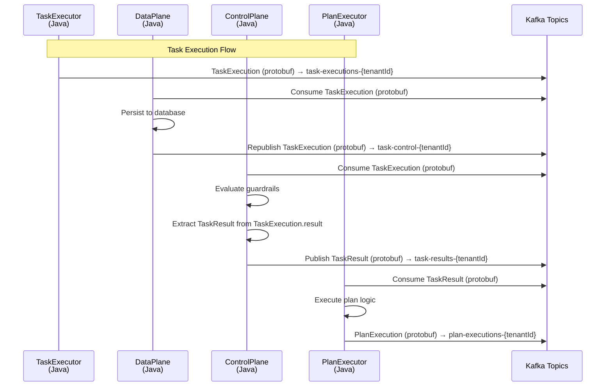
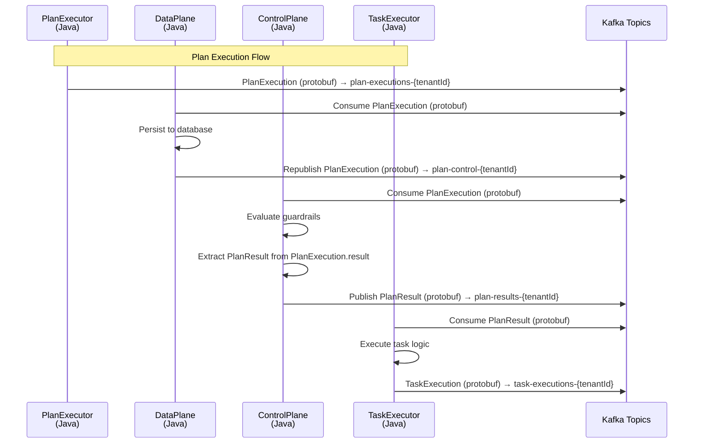

# Java Data Flow Documentation

## Overview

This document describes the corrected protobuf-based data flow between Java microservices in the scalable agent framework. The system uses Protocol Buffers for all message serialization to ensure type safety and performance benefits.

## Architecture

The system consists of the following Java microservices:

1. **DataPlane** - Persists execution data and forwards protobuf messages to control topics
2. **ControlPlane** - Evaluates guardrails and routes messages between executors
3. **TaskExecutor** - Executes individual tasks and publishes TaskExecution protobuf messages
4. **PlanExecutor** - Executes planning logic and publishes PlanExecution protobuf messages

## Message Flow

### 1. Task Execution Flow



### 2. Plan Execution Flow



## Topic Architecture

### Data Plane Topics
- `task-executions-{tenantId}` - TaskExecutor publishes TaskExecution protobuf messages
- `plan-executions-{tenantId}` - PlanExecutor publishes PlanExecution protobuf messages

### Control Topics
- `task-control-{tenantId}` - DataPlane forwards TaskExecution protobuf messages to ControlPlane
- `plan-control-{tenantId}` - DataPlane forwards PlanExecution protobuf messages to ControlPlane

### Result Topics
- `task-results-{tenantId}` - ControlPlane publishes TaskResult protobuf messages for PlanExecutor
- `plan-results-{tenantId}` - ControlPlane publishes PlanResult protobuf messages for TaskExecutor

## Protobuf Message Structures

### TaskExecution
```protobuf
message TaskExecution {
  agentic.common.ExecutionHeader header = 1;
  TaskResult result = 2;
  string task_type = 3;
  string parameters = 4;
}
```

### PlanExecution
```protobuf
message PlanExecution {
  agentic.common.ExecutionHeader header = 1;
  PlanResult result = 2;
  string plan_type = 3;
  string input_task_id = 4;
  string parameters = 5;
}
```

### TaskResult
```protobuf
message TaskResult {
  oneof data {
    google.protobuf.Any inline_data = 1;
    string uri = 2;
  }
  string mime_type = 3;
  uint64 size_bytes = 4;
  string error_message = 5;
}
```

### PlanResult
```protobuf
message PlanResult {
  repeated string next_task_ids = 1;
  map<string, string> metadata = 2;
  string error_message = 3;
  float confidence = 4;
}
```

## Service Responsibilities

### DataPlane
- Consumes TaskExecution and PlanExecution protobuf messages from executors
- Persists execution data to database using JPA entities
- Forwards protobuf messages to control topics without modification
- Uses ProtobufUtils for serialization/deserialization

### ControlPlane
- Consumes TaskExecution and PlanExecution protobuf messages from data plane
- Evaluates guardrails using protobuf message data
- Extracts TaskResult from TaskExecution.result and PlanResult from PlanExecution.result
- Publishes TaskResult and PlanResult protobuf messages to result topics
- Uses ProtobufUtils for serialization/deserialization

### TaskExecutor
- Consumes PlanResult protobuf messages from control plane
- Executes tasks based on PlanResult.nextTaskIds
- Publishes TaskExecution protobuf messages to data plane
- Uses ProtobufUtils for serialization/deserialization

### PlanExecutor
- Consumes TaskResult protobuf messages from control plane
- Executes planning logic based on TaskResult data
- Publishes PlanExecution protobuf messages to data plane
- Uses ProtobufUtils for serialization/deserialization

## Key Implementation Details

### Protobuf Serialization
All services use `ProtobufUtils` for consistent serialization/deserialization:
- `ProtobufUtils.serializeTaskExecution()` / `deserializeTaskExecution()`
- `ProtobufUtils.serializePlanExecution()` / `deserializePlanExecution()`
- `ProtobufUtils.serializeTaskResult()` / `deserializeTaskResult()`
- `ProtobufUtils.serializePlanResult()` / `deserializePlanResult()`

### Kafka Configuration
- All producers use `KafkaTemplate<String, byte[]>` for protobuf messages
- All consumers use `ConsumerRecord<String, byte[]>` for protobuf messages
- Topic patterns use tenant-aware routing with `{tenantId}` placeholders

### Error Handling
- Failed deserialization results in message acknowledgment to prevent infinite loops
- Guardrail evaluation failures are logged but don't block message flow
- Database persistence failures are logged but don't block message forwarding

### Database Persistence
- TaskExecutionEntity and PlanExecutionEntity mirror protobuf structures
- JPA entities include all protobuf fields with appropriate type mappings
- JSON fields store complex protobuf data as serialized JSON strings

## Benefits of Protobuf Implementation

1. **Type Safety** - Compile-time validation of message structures
2. **Performance** - Efficient binary serialization/deserialization
3. **Schema Evolution** - Backward/forward compatibility for message changes
4. **Consistency** - Uniform message format across all services
5. **Validation** - Built-in message validation and error handling

## Monitoring and Observability

- All services log protobuf message processing with execution IDs
- Kafka topic metrics track message throughput and latency
- Database persistence metrics monitor storage performance
- Guardrail evaluation results are logged for audit trails

This corrected implementation ensures that the entire message flow uses protobuf serialization as specified in the requirements, maintaining type safety and performance benefits throughout the system. 