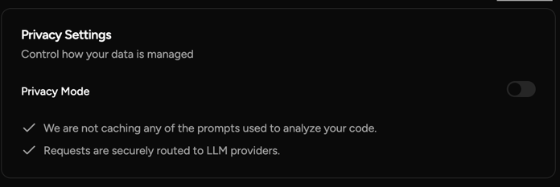

Would like for these tools to capture the prompts so they can be stored in github.

Have to be super precise with the prompts, otherwise a bunc of things will be off a little bit, but sometimes little deviations can cause bigger problems.

Spent a lot of time refining the prompts.  Still, it's a net gain in time.

Cursor sometimes will go wild.  For instance, after it was told to correct some issues with protobuf generation, it went and installed pip3 packages in my global python environment..  Not cool.

Cursor set up a python virtual environment flawlessly.

Traycer is not in "Privacy mode" by default.  Requests to LLMs are not secure and they can keep your prompts.   Big yikes.
